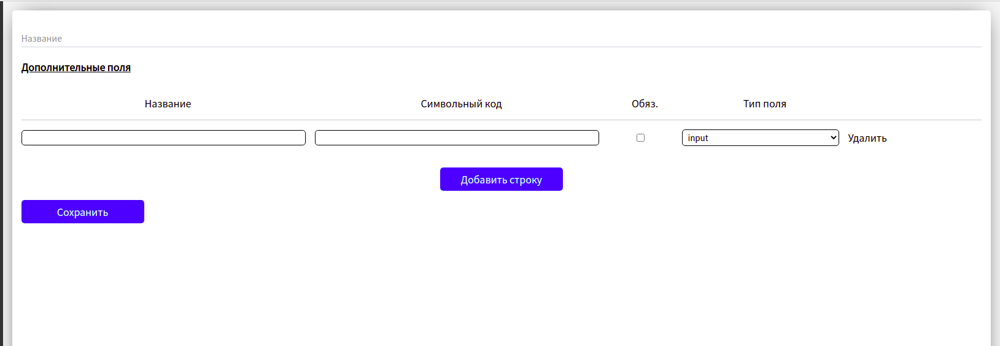

# admin-page-for-nuxt

### Admin page

### implemented at the moment:
* Information blocks
* authorization
* check in
* admin page
* admin header

### Information blocks
The Information block is a thematic content repository.  
For example.
Let's say we have a slider that displays slides of pictures.
We can create a "Slider" Information block and store the pictures themselves in it.  

Let's say we have several sliders. One slider on the main page, 
the second slider in another section, and the third is generally displayed on the user's page.  
Then it turns out we have a lot of messy content and if we have other content, such as news or articles. Information blocks come to the rescue.  
we can structure data on a specific basis.
We can create an Information block for sliders, calling it "Slider" and place content for sliders in it. 
At the moment the logic of Information block is implemented.

###List of Information blocks
 

###Add form of Information blocks
 

###Detail form of Information blocks
